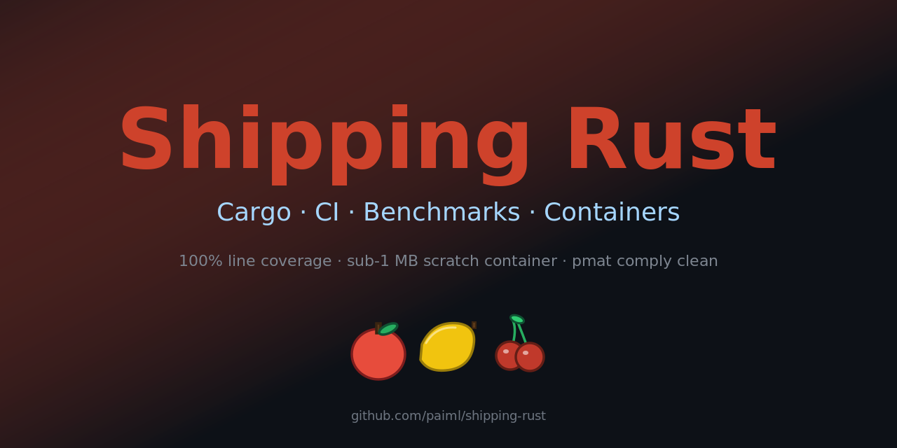

<p align="center">
  
</p>

[](https://github.com/paiml/shipping-rust/actions/workflows/ci.yml)
[](#license)
[](rust-toolchain.toml)
[](https://github.com/paiml/shipping-rust/actions/workflows/ci.yml)
[](Dockerfile)

# shipping-rust

Reference Rust workspace for course **c9 — Shipping Rust: Cargo, CI,
Benchmarks & Containers** in the Coursera Applied AI Engineering / Rust
Data Engineering specializations.

This repo is a complete, opinionated example of what shipping a small
Rust binary looks like end-to-end:

- a Cargo workspace with a typed core library, a CLI, and a benches crate
- explicit error and reporting types, not strings or panics
- 100% line coverage gated by `cargo llvm-cov`
- single-job CI that aggregates fmt / clippy / test / coverage / audit /
  deny / release-build / binary-size budget / bench-smoke
- a multi-stage Docker build that produces a **<2 MB** scratch container
  (stock Docker layer caching only — no external build-cache helpers)
- supply-chain hygiene via `cargo-audit` and `cargo-deny`
- dual MIT / Apache-2.0 licensing

It is the companion to course c12's
[`paiml/zig-from-zero`](https://github.com/paiml/zig-from-zero) — same
scope, same shape, in Rust.

## Workspace layout

| Crate | Kind | Purpose |
|---|---|---|
| [`etl-core`](etl-core/) | library | Typed CSV → JSON Lines pipeline. Rejects malformed rows into a row-aligned `Report`; never panics on bad input. |
| [`etl-cli`](etl-cli/) | binary (`etl`) | Reads CSV from `--input` (path or `-`), writes JSON Lines to `--output` (path or `-`), emits the report on stderr. |
| [`etl-bench`](etl-bench/) | library + bench | Synthetic CSV fixture generator (`synth_csv(n)`) used by criterion benches at 1k / 10k / 100k row sizes. |

The example dataset is fruit measurements: each input row is `id,fruit,weight_g`,
and each output record carries a `size_bucket` of `Small` (<100 g), `Medium`
(100–299 g), `Large` (≥300 g), or `Unknown` (weight missing).

## Provable contracts

The `etl` binary asserts two named contracts at runtime on every
successful run:

- `ROWS_IN_EQUALS_ROWS_OUT` — `rows_in == rows_out + rows_rejected`. The
  `Report` is row-aligned: the rows we read must equal the rows we wrote
  plus the rows we rejected, with nothing falling through silently.
- `REPORT_JSON_ROUNDTRIPS` — `serde_json::to_string(&report)` then
  `serde_json::from_str::<Report>` parses back to a value equal to the
  original. The report is a structured artifact, not a debug dump.

Both contracts also hold under unit and integration tests (`cargo test`).

## Quick start

Requires Rust **1.85.0** (pinned by [`rust-toolchain.toml`](rust-toolchain.toml)).

```bash
# Build everything
cargo build --workspace

# Test (unit + integration)
cargo test --workspace

# 100% line coverage gate
cargo llvm-cov --workspace --fail-under-lines 100

# Lints — clippy with -D warnings, plus the workspace lints in
# Cargo.toml (unsafe_code = "forbid", unwrap_used = "warn", panic = "warn",
# pedantic enabled).
cargo clippy --workspace --all-targets -- -D warnings

# Doc build with -D warnings
RUSTDOCFLAGS="-D warnings" cargo doc --workspace --no-deps

# Supply chain
cargo audit --deny warnings
cargo deny check

# Benches (1k / 10k / 100k rows, criterion)
cargo bench --workspace
```

## Running the CLI

```bash
# CSV in, JSON Lines out, report on stderr
$ printf 'id,fruit,weight_g\n1,apple,150\n2,watermelon,7800\n' | cargo run -q --bin etl
{"id":1,"fruit":"apple","size_bucket":"Medium"}
{"id":2,"fruit":"watermelon","size_bucket":"Large"}
{"rows_in":2,"rows_out":2,"rows_rejected":0,"errors_by_kind":{}}

# Reject paths produce structured rejections, not panics
$ printf 'id,fruit,weight_g\n1,apple,150\nbad_id,banana,118\n3,,77\n4,grape,5\n' | cargo run -q --bin etl
{"id":1,"fruit":"apple","size_bucket":"Medium"}
{"id":4,"fruit":"grape","size_bucket":"Small"}
{"rows_in":4,"rows_out":2,"rows_rejected":2,"errors_by_kind":{"empty_fruit":1,"invalid_id":1}}
```

## Container

The included [`Dockerfile`](Dockerfile) is a plain musl + scratch
multi-stage build — no external Rust build-cache helpers, just stock
Docker layer caching. The pattern follows
[`paiml/forjar`](https://github.com/paiml/forjar)'s own Dockerfile: for a
small workspace the extra dependency is not worth the layer savings. We
rely on Docker's stock layer cache by copying workspace manifests first
so `cargo fetch --locked` is reused whenever sources change but
`Cargo.lock` does not. The final image runs as user `65532` and contains
nothing but the static `etl` binary.

```bash
$ docker build -t shipping-rust:latest .
$ docker images shipping-rust:latest --format "{{.Size}}"
1.5MB

$ printf 'id,fruit,weight_g\n1,apple,150\n' | docker run --rm -i shipping-rust:latest
{"id":1,"fruit":"apple","size_bucket":"Medium"}
{"rows_in":1,"rows_out":1,"rows_rejected":0,"errors_by_kind":{}}
```

A glibc-linked variant is available at [`Dockerfile.distroless-cc`](Dockerfile.distroless-cc)
for workloads that need a libc / TLS roots / `/etc/passwd` (Google's
distroless `cc-debian12:nonroot` base, ~25 MB). Same plain-multi-stage
layering strategy, different runtime base.

## CI

A single GitHub Actions job named `gate` runs the full pipeline against
both MSRV (`1.85.0`) and `stable`:

```
gate (1.85.0 | stable)
├── cargo fmt --check
├── cargo clippy -D warnings
├── cargo doc -D warnings
├── cargo test --workspace --all-targets
├── cargo test --workspace --doc
├── cargo llvm-cov --fail-under-lines 100
├── cargo audit --deny warnings
├── cargo deny check
├── cargo build --release
├── binary-size budget (<8 MB)
└── cargo bench -- --test    (smoke)
```

If `gate` is green, the workspace is ship-ready. See
[`.github/workflows/ci.yml`](.github/workflows/ci.yml).

## What this repo is teaching

- **Cargo workspaces are the unit of distribution**, not single crates.
  `[workspace.package]`, `[workspace.dependencies]`, and
  `[workspace.lints]` are non-optional.
- **Errors are types**, not strings. `EtlError` (an enum) and `ErrorKind`
  (a discriminator the report uses) draw the line cleanly.
- **Reports are row-aligned**. If `rows_in != rows_out + rows_rejected`,
  something fell through silently — and the binary refuses to exit
  cleanly when that happens (the contract asserts at runtime).
- **100% line coverage is achievable** when you write to it. The
  uncovered regions in `cargo llvm-cov`'s output are macro-expansion
  artifacts (clap derive, thiserror, serde derive); every executable
  line in our own source has a test.
- **CI should be one job**, not nine. A single `gate` matrix entry that
  agglomerates fmt / clippy / doc / test / coverage / audit / deny /
  size-budget / bench is far easier to read at a glance than a fan-out
  graph.
- **Containers should be smaller than your CSV input.** The scratch +
  musl pattern lands a static Rust binary at <2 MB without any external
  Rust build-cache helper — Docker's stock layer cache is enough when
  the workspace is this size.

## License

Dual MIT / Apache-2.0, the standard pattern for the Rust ecosystem. See
[LICENSE-MIT](LICENSE-MIT) and [LICENSE-APACHE](LICENSE-APACHE).
